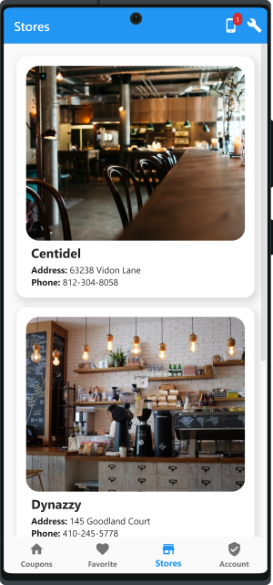
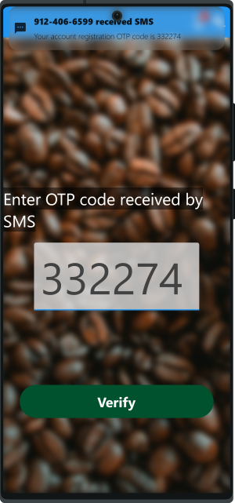

# Full Flutter System Demo for Coffee Coupons
[[English]](README.md)&emsp;[[中文]](README_zh.md)&emsp;[[日本語]](README_ja.md)&emsp;[[한국어]](README_ko.md)&emsp;[[español]](README_es.md)

This project provides a full [Flutter](https://flutter.dev/)/Dart system template from front-end APPs to the backend database to demonstrate a coupon management system, which is suitable for a coffeehouse chain (or any restaurant chain) to build customer loyalty. This project includes several major components:

1. Guest APP for store guest to use coupons.
2. Admin APP for staff to manage the system.
3. Back-end server, that interacts with the two APPs through JSON-based API by HTTP. Provides database storage and business logic handling.

## Highlights
1. **Full featured.** All operation in the demo system, unless otherwise marked, is fully functional in a closed environment simulation.
2. **Easy to use demo.** In a minimal configuration, only one APP is required to install to experience all demo features.
3. **Multilingual support.** 4 languages are supported: English, Chinese(繁體中文), Japanese(日本語), and Korean(한국어).
4. **Pure Dart and standalone.** Provides the advantage of easy migration to various platforms. Both client and server are implemented in Dart language. The demo system can run by itself because no dependencies on external services, such as Firebase.

## Screenshots
Because there are too many screenshots, in this document we only list some highlights. [**Click here to see all screenshots.**](doc/all_screenshots.md)

## Full system demo fits in a single app 
To make this demo system easy to use, the system does not depend on any external services, such as Firebase, Google Cloud Notification, Dockers, or any Email/SMS service. Yet implementation such as account verification and push notification is provided for the sake of completeness. <mark>**All operation in the demo system, unless otherwise marked, is fully functional in a closed environment simulation.**</mark>

For this to work, we introduce the concept of **"mock devices"**. It means we can simulate multiple devices (smartphones or tablets) in a single app. The back-end server also runs embedded with this app by default (can be changed to connect to a remote server by options). In a minimal configuration, you only need to **install one APP**, and this APP can simulate multiple devices running multiple apps by actors with various roles. This is also desirable to demo scenarios such as the interaction among multiple guests, multiple staff, and administrators.

## Application Features
1. **Guest registration:** Guest register by phone number and OTP code (by simulated SMS), and then update basic information.
2. **Coupon redeem:** Guests can choose to use coupons from a list of admin-defined policies according to their individual available points. For example, use 5 points to exchange an espresso coffee or a glass of orange juice. If the guest has enough points and the coupon is redeemed successfully, the points will be deducted from the guest's account. A transaction will be saved for a later query.
3. **User management:** Staff or managers (in our system, they have the role of _user_ which is different from _guest_) can use the admin app to manage (create, delete, update, or query) users. The additional function includes password reset by Email, by phone, or by manually.
4. **Store management:** Staff or managers can use the admin app to create, delete, update, or query stores. A store can be configured to link to multiple users. Each link has the attribute of either staff or manager, representing the user's role in that store. A user in a manager role can manage all the users in that store, but not others as restricted by the system for security purposes. In contrast, a user in an administrator role can manage _all users_. A user in a staff role can give points to guests as store gifts. This is done by scanning the 2D bar code generated by the guest's app using the admin app. A list of stores is also available to be displayed in the guest app for finding directions.
5. **Transaction management:** Staff or managers can create, delete, update, or query transactions. A transaction can be a record of an order a guest has placed in a certain store or points give and takes. For example, if a guest spends more than $20 then he can get 5 points, he or she can then use the 5 points to exchange for another cup of coffee.  A transaction keeps a record like that. In reality, integration with the POS system might be needed, but this is just for demo purposes.
6. **Mock device management:** As mentioned before, in order to demo actors with various roles with ease, we need the ability to simulate multiple devices. These devices can have different (mock) phone numbers or Emails in order to receive verification codes sent by the server. You can easily manage these mock devices or check messages for a specific device in the demo app.

## System Features
1. **Pure Dart**: The code is written in pure Dart completely. There is no need for native dependency such as SQLite. For this, we have chosen [Hive](https://github.com/hivedb/hive) as the backend storage. Hive is known for its performance and scalability. The front-end app is developed with Flutter SDK, while the back-end is developed only with Dart SDK (no Flutter is required for the server, we think it's the correct way to do this). Pure Dart provides the advantage of easy migration to various platforms without the hassles to deal with platform-dependent stuff.
2. **Configurable embedded/remote server:** The backend server runs embedded with the demo app by default. This can be changed by options in the demo app to connect to a remote server. By doing so, you need to prepare your own computer running the server instance and enter the correct server URL in the demo app.
3. **Multilingual support:** The front-end app is fully multilingual support. It comes default with 4 languages: English, Chinese(繁體中文), Japanese(日本語), and Korean(한국어). This can be configured in the demo app at any time.
4. **Dark mode support:** Dark mode can be enabled or disabled in the demo app at any time.

## Sponsor me for more development
If this demo system is useful to you, please consider [sponsor me](https://fundrazr.com/flutter_full_demo). This will allow me to devote more time improving this project or create more projects like this.

Do you want to add more features? [Reach me out](https://github.com/cybercying).

## Manuals and other documents
* [System manual](doc/system_manual.md)
* [User story](assets/markdown/userStory.md)
* [License](LICENSE) (MIT license)
