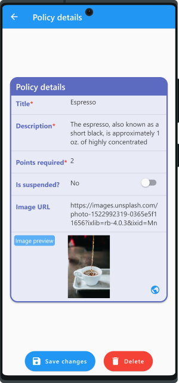
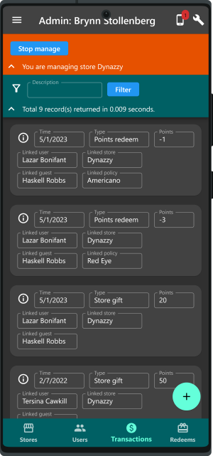

# Demostración completa del sistema para cupones de café en Flutter
[[English]](README.md)&emsp;[[中文]](README_zh.md)&emsp;[[日本語]](README_ja.md)&emsp;[[한국어]](README_ko.md)&emsp;[[español]](README_es.md)

Este proyecto proporciona una plantilla completa de sistema [Flutter](https://esflutter.dev/)/Dart desde aplicaciones frontales a la base de datos de backend para demostrar un sistema de gestión de cupones, que es adecuado para una cadena de cafeterías (o cualquier cadena de restaurantes) para construir lealtad del cliente. Este proyecto incluye varios componentes principales:

1. App huésped para huéspedes.
2. App admin para que el personal administre el sistema.
3. Servidor de back-end, que interactúa con las dos aplicaciones a través de API basada en JSON por HTTP. Proporciona almacenamiento de bases de datos y manejo de lógica comercial.

## Lo más destacado
1. **Funciones completas.** Toda la operación en el sistema de demostración, a menos que se marque lo contrario, es completamente funcional en una simulación de entorno cerrado.
2. **Demo fácil de usar.** En una configuración mínima, solo se requiere una aplicación para instalar para experimentar todas las funciones de demostración.
3. **Soporte multilingüe.** Se apoyan 4 idiomas: inglés, chino, japonés y coreano. (Para español, actualmente solo este documento está disponible. La traducción de la aplicación se realizará más adelante o por solicitud.)
4. **Dart puro y independiente.** Proporciona la ventaja de una fácil migración a varias plataformas. Tanto el cliente como el servidor se implementan en lenguaje Dart. El sistema de demostración puede ejecutarse por sí mismo porque no hay dependencias de servicios externos, como Firebase.

## Capturas de pantalla
Debido a que hay demasiadas capturas de pantalla, en este documento solo enumeramos algunos aspectos destacados. [**Haga clic aquí para ver todas las capturas de pantalla.**](doc/all_screenshots.md)

## La demostración del sistema completo se ajusta en una sola aplicación
Para que este sistema de demostración sea fácil de usar, el sistema no depende de ningún servicio externo, como Firebase, Notificación de Google Cloud, Dockers o cualquier servicio de correo electrónico/SMS. Sin embargo, la implementación, como la verificación de la cuenta y la notificación push, se proporciona en aras de la integridad. <mark>**Toda la operación en el sistema de demostración, a menos que se marque lo contrario, es completamente funcional en una simulación de entorno cerrado.**</mark>

Para que esto funcione, presentamos el concepto de **"dispositivos simulados"**. Significa que podemos simular múltiples dispositivos (teléfonos inteligentes o tabletas) en una sola aplicación. El servidor de back-end también se ejecuta integrado con esta aplicación de forma predeterminada (se puede cambiar para conectarse a un servidor remoto por opciones). En una configuración mínima, solo necesita **instalar una app**, y esta app puede simular múltiples dispositivos que ejecutan múltiples aplicaciones por actores con varios roles. Esto también es deseable para escenarios de demostración, como la interacción entre huéspedes múltiples, personal múltiple y administradores.

## Características de la aplicación
1. **Registro de huéspedes:** Registro de huéspedes por número de teléfono y código OTP (por SMS simulado), y luego actualizar la información básica.
2. **Cupón usar:** Los huéspedes pueden elegir usar cupones de una lista de políticas definidas por el administrador de acuerdo con sus puntos individuales disponibles. Por ejemplo, usa 5 puntos para intercambiar un café expreso o un vaso de jugo de naranja. Si el huésped tiene suficientes puntos y el cupón se canjea con éxito, los puntos se deducirán de la cuenta del huéspede. Una transacción se guardará para una consulta posterior.
3. **Gestión de usuarios:** El personal o los administradores (en nuestro sistema, tienen la función de _usuario_ que es diferente de _huéspede_) pueden usar la app admin para administrar (crear, eliminar, actualizar o consultar) a los usuarios. La función adicional incluye restablecimiento de contraseña por correo electrónico, por teléfono o manualmente.
4. **Gestión de tiendas:** El personal o los gerentes pueden usar la app admin para crear, eliminar, actualizar o consultar tiendas. Se puede configurar una tienda para vincular a varios usuarios. Cada vinculo tiene el atributo personal o gerente, representando el rol del usuario en ese tienda. Un usuario en un rol de gerente puede gestionar a todos los usuarios en ese tienda, pero no a otros tan restringidos por el sistema por motivos de seguridad. Por el contrario, un usuario en un rol de administrador puede gestionar _todos los usuarios_. Un usuario en un rol de personal puede dar puntos a los huéspedes como regalos de la tienda. Esto se hace escaneando el código de barras 2D generado por la app huésped usando la app admin. Una lista de tiendas también está disponible para ser mostrada en la app huésped para encontrar direcciones.
5. **Gestión de transacciones:** El personal o los gerentes pueden crear, eliminar, actualizar o consultar transacciones. Una transacción puede ser un registro de un pedido que un huésped ha colocado en una tienda determinada o puntos dan y toman. Por ejemplo, si un huésped gasta más de $20 entonces puede obtener 5 puntos, entonces puede usar los 5 puntos para cambiar por otra taza de café.  Una transacción mantiene un registro como ese. En realidad, la integración con el sistema POS podría ser necesaria, pero esto es solo para fines de demostración.
6. **Gestión de dispositivos simulados:** Como se mencionó anteriormente, para demostrar actores con varios roles con facilidad, necesitamos la capacidad de simular múltiples dispositivos. Estos dispositivos pueden tener diferentes números de teléfono (simulados) o correos electrónicos para recibir los códigos de verificación enviados por el servidor. Puede gestionar fácilmente estos dispositivos simulados o revisar los mensajes de un dispositivo específico en la aplicación de demostración.

## Características del sistema
1. **Dart puro**: El código está escrito en Dart puro completamente. No hay necesidad de dependencia nativa como SQLite. Para esto, hemos elegido [Hive](https://github.com/hivedb/hive) como el almacenamiento backend. Hive es conocido por su rendimiento y escalabilidad. La aplicación front-end se desarrolla con Flutter SDK, mientras que el back-end se desarrolla solo con Dart SDK (no se requiere Flutter para el servidor, creemos que es la forma correcta de hacer esto). Dart puro ofrece la ventaja de la fácil migración a varias plataformas sin los problemas para hacer frente a las cosas dependientes de la plataforma.
2. **Servidor integrado/remoto configurable:** El servidor de back-end se ejecuta integrado con la aplicación de demostración de forma predeterminada. Esto se puede cambiar por las opciones en la aplicación de demostración para conectarse a un servidor remoto. Al hacerlo, debe preparar su propio equipo que ejecuta la instancia del servidor e ingresar la URL del servidor correcta en la aplicación de demostración.
3. **Multilingual support:** Se apoyan 4 idiomas: inglés, chino, japonés y coreano. (Para español, actualmente solo este documento está disponible. La traducción de la aplicación se realizará más adelante o por solicitud.)
4. **Soporte en modo oscuro:** El modo oscuro se puede activar o desactivar en la aplicación de demostración en cualquier momento.

## Patrocinarme para más desarrollo
Si este sistema de demostración es útil para usted, por favor considere [patrocinarme](https://fundrazr.com/flutter_full_demo). Esto me permitirá dedicar más tiempo a mejorar este proyecto o crear más proyectos como este.

¿Quieres añadir más funciones? [Comunícate conmigo](https://github.com/cybercying).

## Manuales y otros documentos (inglés)
* [System manual](doc/system_manual.md)
* [User story](assets/markdown/userStory.md)
* [License](LICENSE) (MIT license)