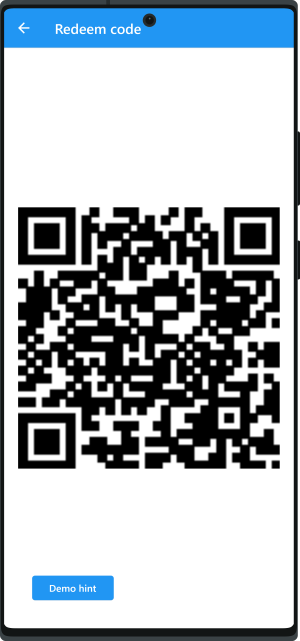
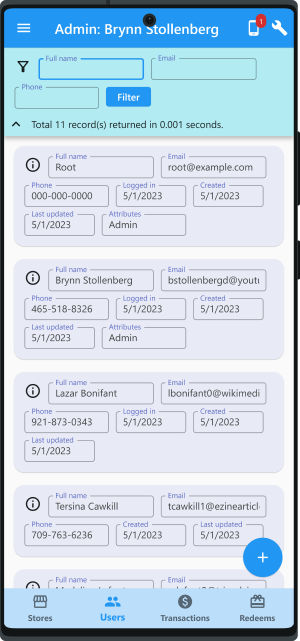
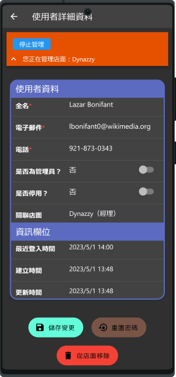
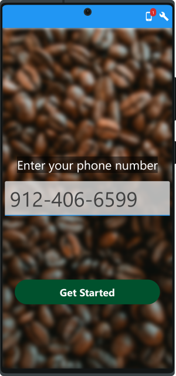

# フラッターでコーヒークーポン用のシステムのフルデモ
[[English]](README.md)&emsp;[[中文]](README_zh.md)&emsp;[[日本語]](README_ja.md)&emsp;[[한국어]](README_ko.md)&emsp;[[español]](README_es.md)

このプロジェクトは、[Flutter](https://flutter.dev/)/Dartを用いて、フロントエンドアプリからバックエンドデータベースまでの完全なシステムテンプレートを提供して、コーヒーチェーン（または飲食店チェーンに適したクーポン管理システムを実装します。）の顧客ロイヤルティを構築することに役たちます。このプロジェクトには、いくつかの主要なコンポーネントが含まれています。

1. 顧客のためのゲストアプリ。
2. システムを管理するためのスタッフ向けの管理者アプリ。 
3. HTTPによるJSONベースのAPIを介して上の2つのアプリと対話するバックエンドサーバー。データベースストレージとビジネスロジック処理を提供します。

## ハイライト
1. **フルフィーチャー**。このデモシステムにすべての操作は、特に言及されていない限り、クローズド環境シミュレーションで完全に機能できます。
2. **使いやすいデモ**。最小限の構成では、すべてのデモ機能を体験するためにインストールする必要があるアプリは1つだけです。
3. **多言語サポート**。英語、中国語、日本語、韓国語の4言語がサポートされています。
4. **Pure Dart及びスタンドアロン** さまざまなプラットフォームに簡単に移植できるという利点があります。クライアントとサーバーの両方がDart言語で実装されています。FireBaseなどの外部サービスへの依存関係はないので、スタンドアロンでも実行できます。

## スクリーンショット
スクリーンショットが多すぎるため、ここではいくつかのハイライトのみをリストします。[**すべてのスクリーンショットを表示するには、ここをクリックしてください。**](doc/all_screenshots.md)

## フルシステムデモは、単一のアプリに収まる

このデモシステムを使いやすくするために、外部サービスに依存しません。外部サービスとは、例えばファイアベース、Google Cloud Messaging、ドッカー、または電子メール/SMSサービスなどのことです。ただし、アカウント検証やプッシュ通知などの機能の実装については、完全性のためにこのデモシステムは提供します。 <mark> **このデモシステムでのすべての操作は、特に言及されていない限り、クローズド環境シミュレーションで完全に機能できます** </mark>

このためには、「**モックデバイス**」という概念を我々が導入します。これはつまり、単一のアプリで複数のデバイス（スマートフォンまたはタブレット）をシミュレートできることを意味します。バックエンドサーバーは、埋め込み型としてこのアプリをデフォルトで共に実行します（オプションでリモートサーバーに接続するように変更できます）。最小限の構成では、1つのアプリをインストールするだけでフルデモができます。このアプリは、さまざまな役割を持つ人員による複数のアプリを実行している複数のデバイスをシミュレートすることができます。これは、複数の顧客、複数のスタッフ、および管理者間のやり取りをシミュレートというデモシナリオに特に適しています。

## アプリケーション機能
1. **顧客の登録**：電話番号とOTPコード（シミュレーションSMSによる）でゲスト登録し、基本情報を更新します。
2. **クーポンの利用**：顧客は、個々の利用可能なポイントに従って、管理者定義のポリシーのリストからクーポンを使用することができます。たとえば、ある顧客は5ポイントを使用して、エスプレッソコーヒーまたはオレンジジュースを交換するということです。顧客に十分なポイントがあり、クーポンが正常に交換された場合、ポイントは顧客のアカウントから差し引かれます。このイベントの記録は、後の監査のためにトランザクションという形式として保存されます。
3. **ユーザー管理**：スタッフまたはマネージャーは（このデモシステムにとっては、顧客とは異なるユーザーという役目があります）、管理者アプリを使用してユーザーを管理（作成、削除、更新、またはクエリ）します。その他の機能は、電子メール、電話、または手動でパスワードをリセットする機能も含まれます。
4. **店舗管理**：スタッフまたはマネージャーは、管理者アプリを介して、店舗を作成、削除、更新、またはクエリすることができます。 店舗は、複数のユーザーにリンクするように設定できます。そういうリンクには、スタッフまたはマネージャーのいずれかの属性があり、その店舗でのユーザーの役割を表しています。マネージャーの役割のユーザーは、その店舗のすべてのユーザーを管理できます。だが、セキュリティ目的でその他ユーザーを管理することができません。これはシステムによって制限されています。一方、管理者という役割のユーザーはすべてのユーザーを管理できます。スタッフの役割のユーザーは、店舗のギフトとしてゲストにポイントを与えることができます。これは、スタッフが管理者アプリを使用して顧客のゲストアプリによって生成された2Dバーコードをスキャンすることによって行われます。店舗のリストは、道順を見つけるためにゲストアプリに表示することもできます。
5. **トランザクション管理**：スタッフまたはマネージャーは、トランザクションを作成、削除、更新、またはクエリすることができます。トランザクションは、顧客が特定の店舗に注文またはポイントの増減を記録することができます。たとえば、ある顧客が20ドル以上を費やしている場合は、5ポイントを獲得できます。その顧客はまた5ポイントを使用して、別のコーヒーを交換できます。トランザクションはそのようなイベントの記録を保持します。実際には、POSシステムとの統合が必要になるかもしれませんが、ここにデモに必要なもののみを実装します
6. **モックデバイス管理**：前述のように、さまざまな役割を演じる複数の人員を簡単にデモするためには、複数のデバイスをシミュレートする機能が必要です。これらのデバイスは、サーバーから送信された検証コードなどを受信するために、異なる（模擬）電話番号または電子メールを持つことができます。これらのモックデバイスを簡単に管理したり、デモアプリによって特定のモックデバイスのメッセージをチェックすることができます。

## システム機能
1. **Pure Dart**：このデモシステムのコードはPure Dartで開発されています。SQLiteなどのようなネイティブ依存は必要ありません。このために、バックエンドストレージとして[Hive](https://github.com/hivedb/hive)を選択しました。Hiveは、そのパフォーマンスとスケーラビリティで知られています。フロントエンドアプリはFlutter SDKで開発されていますが、バックエンドはDart SDKのみで開発されます（サーバーにはFlutterは必要ありません。これこそ正しい方法だと思います）。Pure Dartは、プラットフォームに依存するものに対処する手間なしで、さまざまなプラットフォームへの簡単な移植という利点を提供します。
2. **設定可能な埋め込み型のサーバーまたはリモートサーバー**：バックエンドサーバーは、デフォルトでデモアプリで埋め込まれて共に実行されます。一方、リモートサーバーに接続するためにデモアプリのオプションによって変更できます。そうすることで、このサーバーを実行している独自のコンピューターを準備し、デモアプリに正しいサーバーURLを入力する必要があります。
3. **多言語サポート**。英語、中国語、日本語、韓国語の4言語がサポートされています。これは、いつでもデモアプリで設定できます。
4. **ダークモードのサポート**：ダークモードは、デモアプリでいつでも有効または無効にできます。

## もっと開発のために私をスポンサーしてください 
このデモシステムは役に立つ場合は、[私をスポンサー](https://fundrazr.com/flutter_full_demo)することをご検討ください。これにより、このプロジェクトを改善するためにより多くの時間を投じたり、またはこのようなプロジェクトをさらに生み出すしたりすることができます。

機能の追加をご希望でしょうか？ [私に連絡してください](https://github.com/cybercying)。

## マニュアルおよびその他のドキュメント（英語）
* [System manual](doc/system_manual.md)
* [User story](assets/markdown/userStory.md)（ユーザーストーリー）
* [License](LICENSE) (MIT license)