# 커피 쿠폰을위한 완전한 플러터 시스템 데모
[[English]](README.md)&emsp;[[中文]](README_zh.md)&emsp;[[日本語]](README_ja.md)&emsp;[[한국어]](README_ko.md)&emsp;[[español]](README_es.md)

이 프로젝트는 완전한 [플러터](https://flutter-ko.dev/)/Dart 시스템 템플릿을 프론트 엔드 앱에서 백엔드 데이터베이스까지 제공하여 커피 하우스 체인(또는 어떤 음식 체인점)에 고객 충성도를 구축하기 위해 적합한 쿠폰 관리 시스템을 데모합니다. 이 프로젝트에는 몇 가지 주요 구성 요소가 포함됩니다:

1. 고객를위한 게스트 앱.
2. 시스템 관리하는 직원을위한 관리자 앱.
3. 백엔드 서버는 HTTP의 JSON 기반 API를 통해 앞서 언급한 두 앱과 상호 작용합니다. 데이터베이스 스토리지 및 비즈니스 로직 처리를 제공합니다.

## 하이라이트
1. **완전한 기능.** 달리 표시되지 않는 밖에 데모 시스템의 모든 작업은 폐쇄 된 환경 시뮬레이션에서 완전히 작동합니다.
2. **사용하기 쉬운 데모.** 최소 구성에서는 모든 데모 기능을 경험하기 위해 하나의 앱 만 설치하면됩니다.
3. **다국어 지원.** 4 언어가 지원됩니다 : 영어, 중국어, 일본어 및 한국어.
4. **Pure Dart과 독립실행.** 다양한 플랫폼으로 쉽게 마이그레이션 할 수있는 이점을 제공합니다. 클라이언트와 서버는 모두 Dart 언어로 구현됩니다. Firebase와 같은 외부 서비스에 대한 의존성이 없으니까, 독립실행 할수있습니다.

## 스크린 샷
스크린 샷이 너무 많기 때문에 이 문서에는 일부 하이라이트 만 나열합니다. [**모든 스크린 샷을 보려면 여기를 클릭하십시오.**](doc/all_screenshots.md)

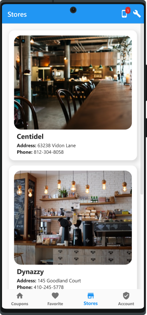
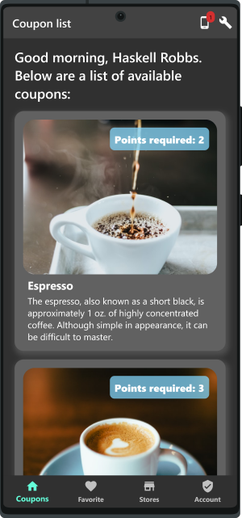
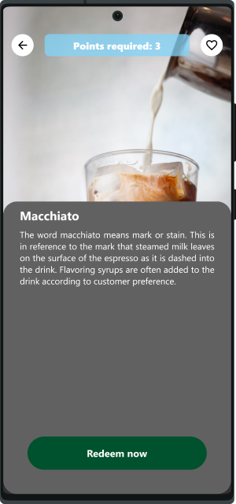
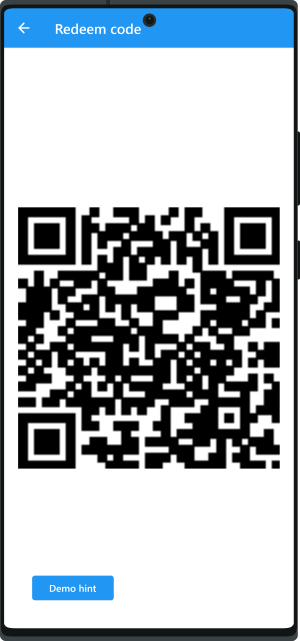
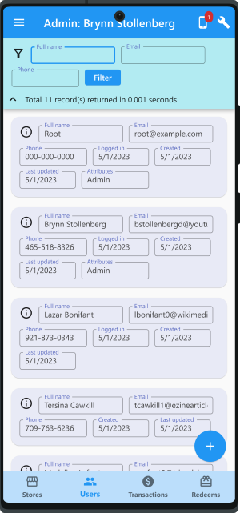
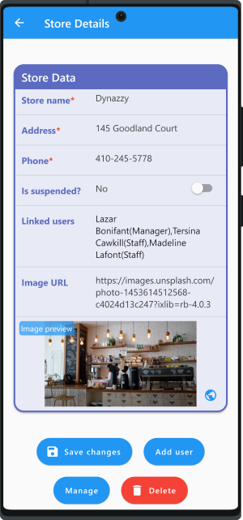
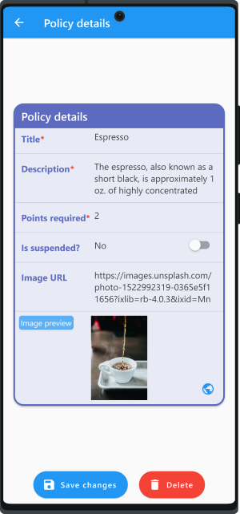
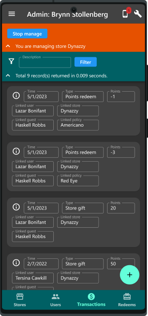
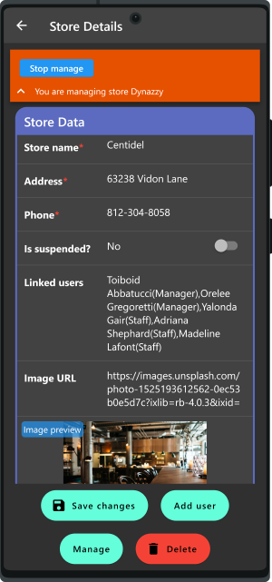
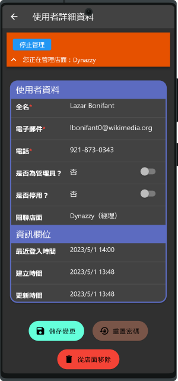
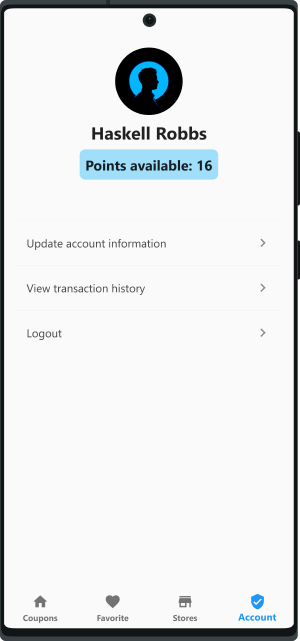
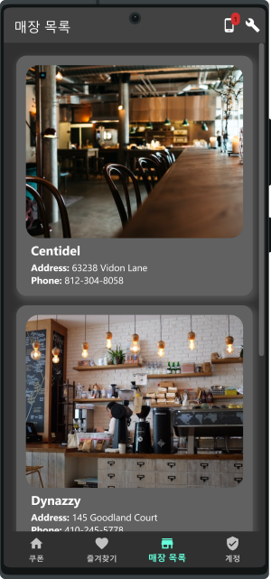
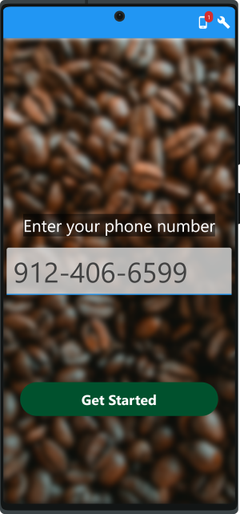
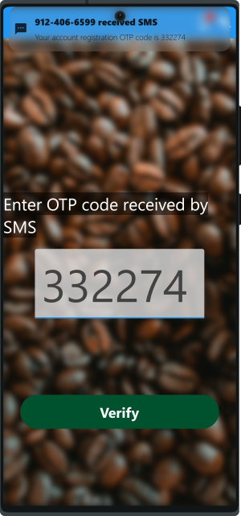

## 전체 시스템 데모는 단일 앱에 거둡나다
이 데모 시스템을 쉽게 사용하기 위해 시스템은 Firebase, Google Cloud 알림, Dockers 또는 이메일/SMS 서비스와 같은 외부 서비스에 의존하지 않습니다. 그러나 완전성을 위해 계정 확인 및 푸시 알림과 같은 구현이 제공됩니다.<mark>**달리 표시되지 않는 한 데모 시스템의 모든 작업은 폐쇄 된 환경 시뮬레이션에서 완전히 작동합니다.**</mark>

이 목표를 달성하기 위해 "**모의 장치**"라는 개념을 도입해야합니다. 이는 단일 앱에서 여러 장치 (스마트 폰 또는 태블릿)를 시뮬레이션 할 수 있음을 의미합니다. 백엔드 서버는 기본적으로 이 앱과 함께 내장하게 실행되는데 옵션으로 원격 서버에 연결하도록 변경할 수 있습니다. 최소한의 구성에서는 하나의 데모앱 를 설치하면 다양한 역할을 가진 여러 앱을 실행하는 여러 장치를 시뮬레이션 할 수 있습니다. 이는 여러 손님, 여러 직원 및 관리자 간의 상호 작용과 같은 데모 시나리오에는 적합하다.

## 응용 기능
1. **고객 등록:** 전화 번호 및 OTP 코드(시뮬레이션 된 SMS) 로 고객 등록 한 다음 계좌에서 기본 정보를 업데이트하니다.
2. **쿠폰 사용:** 고객은 개별 가용한 포인트에 따라 관리자 정의 정책 목록에서 쿠폰을 사용할 수 있습니다. 예를 들어, 5 포인트을 사용하여 Espresso 커피 또는 오렌지 주스 한 잔을 교환하다고 합니다. 고객에게 충분한 포인트가 있고 쿠폰이 성공적으로 사용되면 고객의 계좌에서 포인트가 공제됩니다. 이 이벤트의 기록은 후속 감사를 위해 트랜잭션 형식으로 저장됩니다.
3. **사용자 관리:** 직원 또는 매니저 (우리 시스템에서 고객 와 다른 사용자의 역할이 있습니다)는 관리자 앱을 사용하여 사용자를 관리 (작성, 삭제, 업데이트 또는 쿼리) 할 수 있습니다. 그밖에 기능에는 이메일, 전화 또는 수동으로 비밀번호 재설정이 포함됩니다.
4. **상점 관리:** 직원 또는 매니저는 관리 앱을 사용하여 매장를 작성, 삭제, 업데이트 또는 쿼리 할 수 있습니다. 매장는 여러 사용자에게 링크하도록 구성 할 수 있습니다. 각 링크에는 직원 또는 매니저의 속성이 있으며 해당 매장에서 사용자의 역할을 나타냅니다. 매니저 역할의 사용자는 해당 매장의 모든 사용자를 관리 할 수 있는데 다른 사용자를 관리할 수 없습니다. 한편, 관리자 역할의 사용자는 모든 사용자를 관리 할 수 있습니다. 직원 역할의 사용자는 고객에게 매장 선물로 포인트를 제공 할 수 있습니다. 이는 관리자 앱을 사용하여 게스트 앱에서 생성 된 2D 바코드를 스캔하기로 수행됩니다. 길을 가르쳐주기 위해 게스트 앱에 매장 목록을 표시 할 수 있습니다.
5. **트랜잭션 관리:** 직원 또는 매니저는 트랜잭션을 생성, 삭제, 업데이트 또는 쿼리 할 수 있습니다. 트랜잭션는 고객이 특정 매장에 주문 또는 포인트의 증가 또는 감소를 기록할 수 있습니다. 예를 들어, 고객이 20 달러 이상을 소비하면 5 포인트를 얻을 수 있으면 그 5 포인트를 사용하여 다른 커피 한 잔을 교환 할 수 있습니다. 트랜잭션는 그런 기록을 저장합니다. 실제로 POS 시스템과의 통합이 필요할 수도 있지만 이는 데모 목적을위한 만 것입니다.
6. **모의 장치 관리:** 앞에서 언급 한 바와 같이, 다양한 역할을 가진 인원를 쉽게 데모하려면 여러 장치를 시뮬레이션 할 수있는 기능이 필요합니다. 이 장치는 서버에서 검증 코드를 받기 위해 다른 (모의) 전화 번호 또는 이메일을 가질 수 있습니다. 데모 앱에서 이러한 모의 장치를 쉽게 관리하거나 특정 장치에 대한 메시지를 체크할 수 있습니다.

## 시스템 기능
1. **Pure Dart**: 코드는 Pure Dart로 완전히 작성되었습니다. SQLite와 같은 네이티브 의존성이 필요하지 않습니다. 이를 위해 백엔드 스토리지는 [Hive](https://github.com/hivedb/hive)를 선택했습니다. Hive는 높은 성능과 확장성으로 유명합니다. 프론트 엔드 앱은 플러터 SDK로 개발되었으며 백엔드는 Dart SDK만으로 개발됩니다 (서버에는 플러터가 필요하지 않으므로 그야말로 올바르게 수행하는 방법이라고 생각합니다). Pure Dart는 플랫폼 의존성을 다루기 위해 번거로움없이 다양한 플랫폼으로 쉽게 마이그레이션 할 수있는 이점을 제공합니다.
2. **선택 가능한 내장/원격 서버:** 백엔드 서버는 기본적으로 데모 앱으로 내장되어 실행됩니다. 데모 앱의 옵션으로 원격 서버에 연결하려면 변경할 수 있습니다. 그렇게 하면 서버를 실행하는 컴퓨터를 스스로 준비하고 데모 앱에서 올바른 서버 URL을 입력해야합니다.
3. **다국어 지원:** 프론트 엔드 앱은 4 언어가 지원됩니다: 영어, 중국어, 일본어 및 한국어.(한국어). 이것은 언제든지 데모 앱에서 설정 할 수 있습니다.
4. **다크 모드 지원:** 다크 모드를 사용하는지는 데모 앱에서 설정 할 수 있습니다.

## 더 많은 개발을 위해 저를 스폰서하십시오
이 데모 시스템이 유용한다고 생각하시면  [저를 스폰서](https://fundrazr.com/flutter_full_demo)하다고를 고려해보십시오. 이를 통해 저는 그 프로젝트를 개선하는 데 더 많은 시간을 투입하거나 이와 같은 더 많은 프로젝트를 만들 수 있습니다.

더 많은 기능을 추가 하시겠습니까? [저에게 연락하십시오](https://github.com/cybercying).

## 매뉴얼 및 기타 문서 (영어)
* [System manual](doc/system_manual.md)
* [User story](assets/markdown/userStory.md)
* [License](LICENSE) (MIT license)